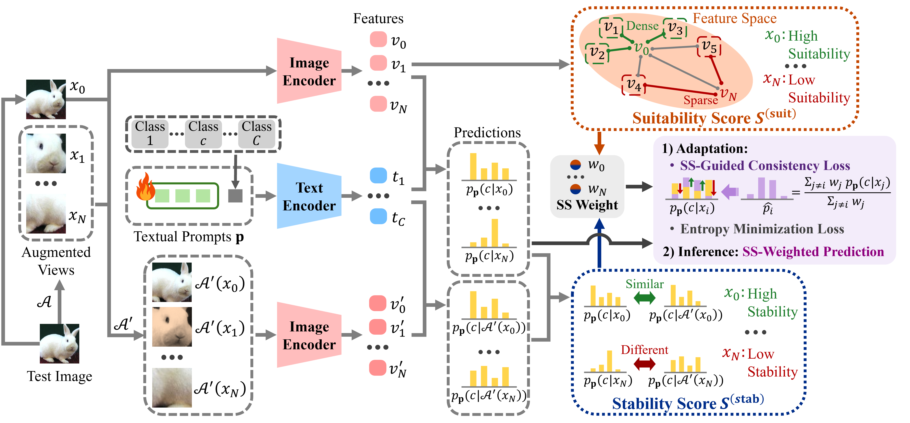

# SS-TPT: Stability and Suitability-Guided Test-Time Prompt Tuning for Adversarially Robust Vision-Language Models

Official PyTorch implementation of the ICML 2026 paper: **"[SS-TPT: Stability and Suitability-Guided Test-Time Prompt Tuning for Adversarially Robust Vision-Language Models](https://arxiv.org/abs/2606.06943)"**.

## 📌 Overview



Vision-language models such as CLIP achieve strong zero-shot recognition but remain vulnerable to adversarial perturbations. Existing test-time adaptation defenses often rely on many augmented views, which introduces a clear robustness-throughput trade-off.

We propose **SS-TPT** (Stability and Suitability-Guided Test-Time Prompt Tuning), a test-time defense framework that evaluates the quality of each augmented view and uses reliable views for robust adaptation and prediction.

At test time, SS-TPT follows a view-quality-driven prompt tuning pipeline:

1. Generate multiple augmented views of a test image.
2. Measure **stability**, i.e., prediction invariance under weak augmentations.
3. Measure **suitability**, i.e., feature-space density among views.
4. Combine both scores into an SS score.
5. Use SS scores for SS-guided consistency loss and SS-weighted prediction.

SS-TPT achieves strong adversarial robustness while preserving clean accuracy and maintaining practical test-time efficiency.

## ⚙️ Dependencies

We recommend setting up a virtual environment. Below are the core dependencies required to run the code:

* `torch` (>= 2.0.0)
* `torchvision`
* `numpy==1.26.4`
* `scipy==1.14.1`
* `Pillow==11.1.0`
* `h5py==3.13.0`
* `tqdm==4.67.1`

## 📂 Dataset Preparation

Please follow [CoOp](https://github.com/KaiyangZhou/CoOp) and manually download the required datasets.

Place the downloaded datasets into your dataset root directory. In our script, the default dataset path is:

```bash
/home/work/TPT/data
```

Make sure to check/update the dataset paths and class names in the files under `data/`, including `data/fewshot_datasets.py`.

## 🚀 How to Run

We provide a bash script (`run_sstpt.sh`) to reproduce SS-TPT evaluations.

### Running the Evaluation

To execute the tests, simply run the bash script from the root of your project:

```bash
bash run_sstpt.sh
```

### Understanding the Script Variables

Inside `run_sstpt.sh`, you can modify several parameters to test different setups:

* `DATASETS`: The datasets to evaluate on, e.g., `"Caltech101"`.
* `-a`, `--arch`: The CLIP backbone architecture, e.g., `"RN50"`.
* `-b`, `--batch-size`: Batch size, corresponding to the number of views including the original image.
* `--gpu`: GPU index used for evaluation.
* `--ctx_init`: Initial prompt context, e.g., `"a_photo_of_a"`.
* `--eps`: PGD attack budget. Use `0.0` for clean evaluation.
* `--steps`: Number of PGD attack steps.
* `--output_dir`: Directory where evaluation logs are saved.

The script runs both clean and adversarial evaluations and saves the results under `output_results/sstpt/`.

## 📖 Citation

If you find our work helpful for your research, please consider citing our paper:

```bibtex
@inproceedings{kim2026sstpt,
  title={SS-TPT: Stability and Suitability-Guided Test-Time Prompt Tuning for Adversarially Robust Vision-Language Models},
  author={Kim, Sunoh and Um, Daeho},
  booktitle={Proceedings of the International Conference on Machine Learning (ICML)},
  year={2026}
}
```

## 🙏 Acknowledgements

We would like to acknowledge [R-TPT](https://github.com/TomSheng21/R-TPT), whose codebase served as the inspiration and foundation for this repository. We are deeply grateful to the authors for their valuable contributions.
